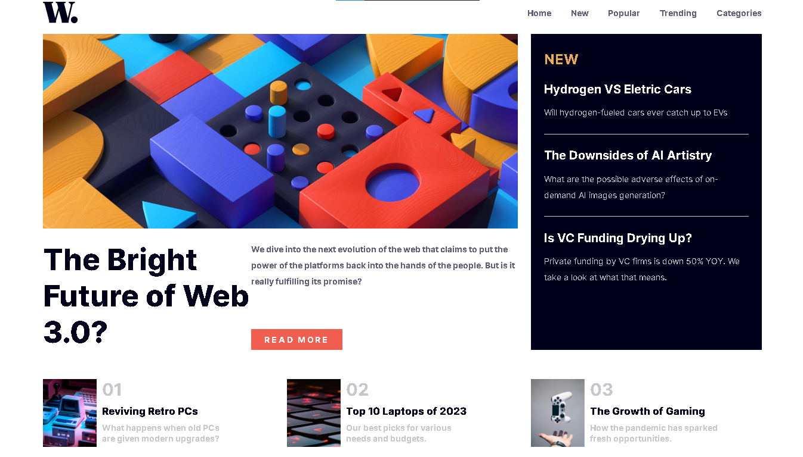
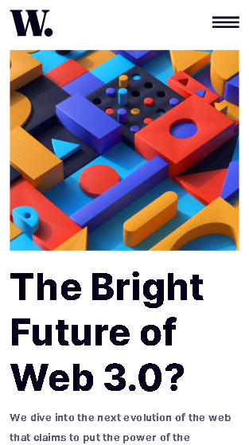

# Frontend Mentor - News homepage solution

This is a solution to the [News homepage challenge on Frontend Mentor](https://www.frontendmentor.io/challenges/news-homepage-H6SWTa1MFl). Frontend Mentor challenges help you improve your coding skills by building realistic projects. 

## Overview

### The challenge

Users should be able to:

- View the optimal layout for the interface depending on their device's screen size
- See hover and focus states for all interactive elements on the page

### Screenshot

### Links

- Solution URL: [GitHub](https://github.com/Thesamramos/News-Homepage)
- Live Site URL: [Page](https://thesamramos.github.io/News-Homepage/)

## My process

### Built with

- Semantic HTML5 markup
- CSS custom properties
- Flexbox
- CSS Grid

## Author

- Website - [Samuel Batista](https://thesamramos.github.io/portifolio/)
- Frontend Mentor - [@Thesamramos](https://www.frontendmentor.io/profile/Thesamramos)
- Linkedin - [Samuel Batista](www.linkedin.com/in/samuel-batista-profile)
